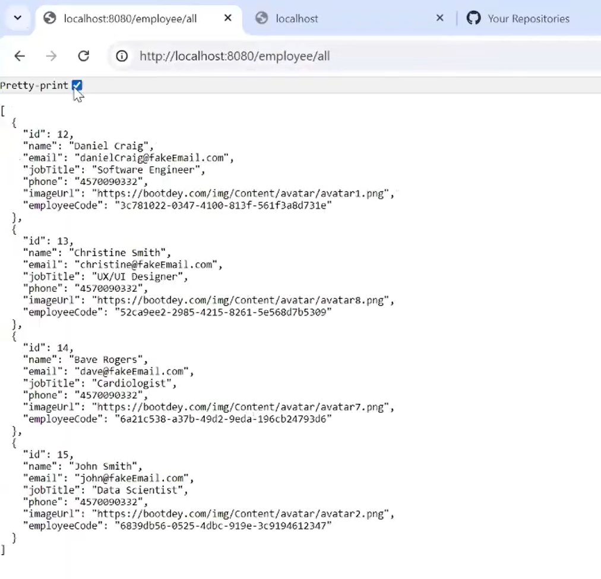
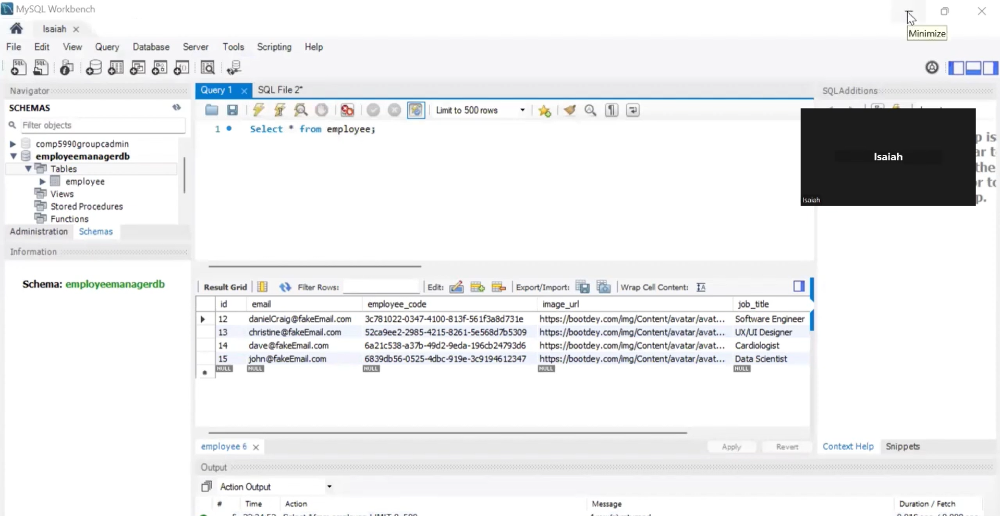
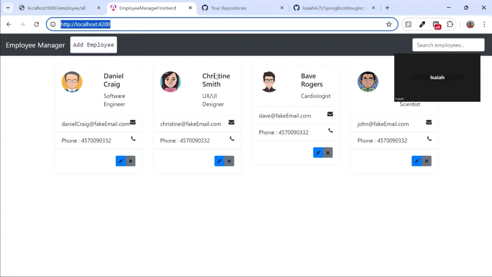
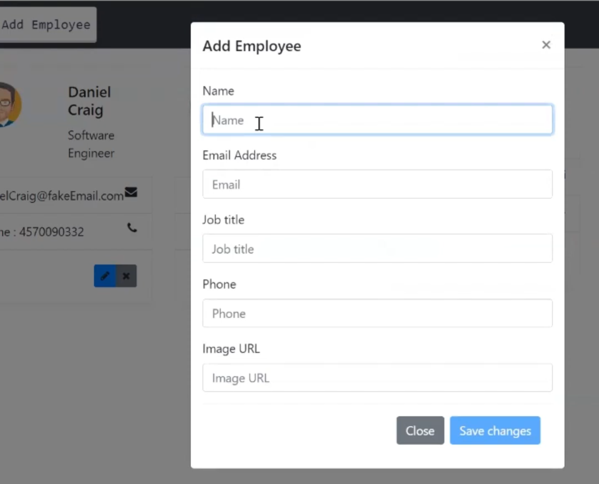
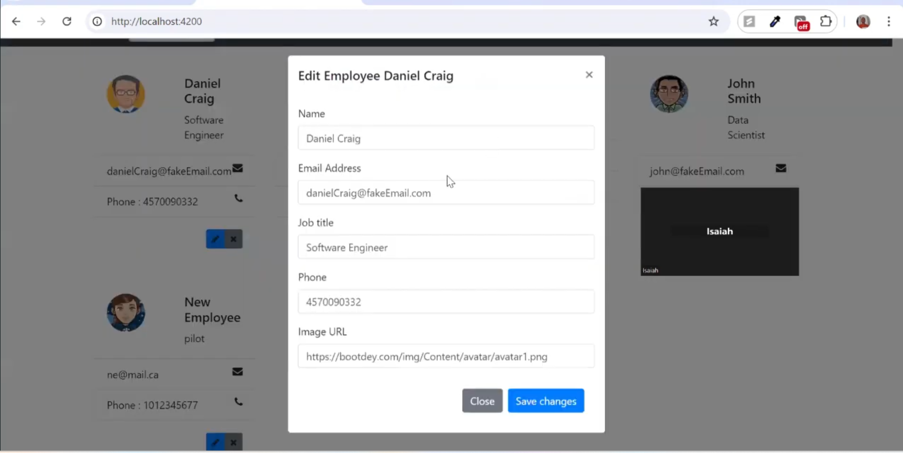
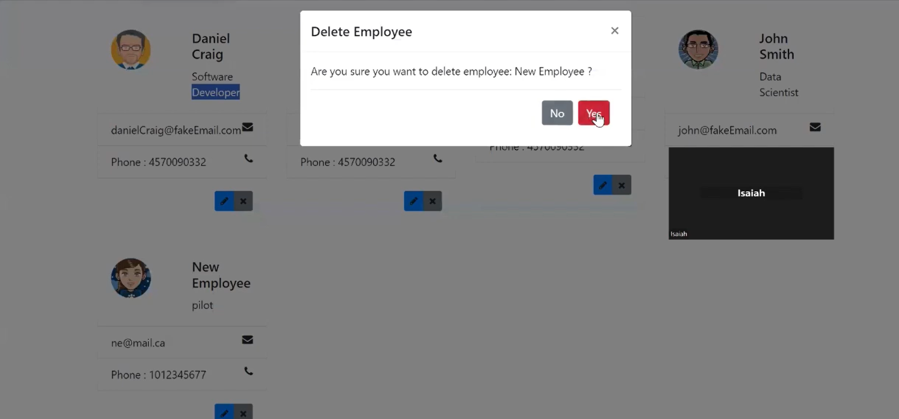
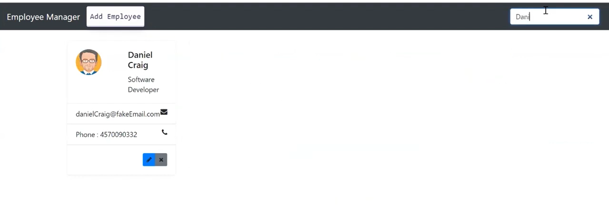

# Employee Manager FullStack Application
 Fullstack Angular, Spring Boot and MySQL application

## Description
This is a fullstack application that allows users to manage employees. The frontend is built using Angular and the backend is built using Spring Boot. The database used is MySQL. The application allows users to add, update, delete and view employees.

## SpringBoot MySQL Database environment variables
requires the following environment variables to be set:
```DB_USERNAME```
```DB_PASSWORD```

## Running the application
### Backend (Spring Boot)
1. Navigate to the backend directory (cd EmployeeManager)
2. Mkake sure you have the following environment variables set:
```DB_USERNAME```
```DB_PASSWORD```
3. Run the following command to start the Spring Boot application:
``` ./mvnw spring-boot:run```
4. Or you can run the application using your IDE (IntelliJ, Eclipse, etc)\
The application will run on port 8080

### Frontend (Angular)
1. Navigate to the frontend directory (cd EmployeeManagerFrontend)
2. Run the following command to start the Angular application:
```ng serve```\
The application will run on port 4200

## Youtube demo
[youtube demo](https://youtu.be/OcTEFVhLh1U)

## Screenshots






